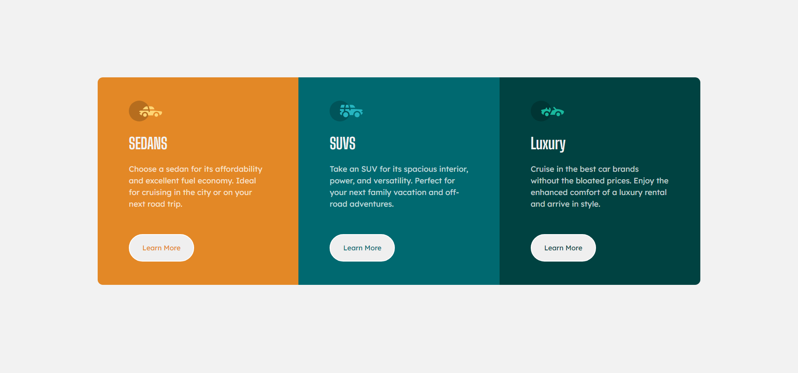

# Frontend Mentor - 3-column preview card component solution

This is a solution to the [3-column preview card component challenge on Frontend Mentor](https://www.frontendmentor.io/challenges/3column-preview-card-component-pH92eAR2-). Frontend Mentor challenges help you improve your coding skills by building realistic projects. 

## Table of contents

- [Overview](#overview)
  - [The challenge](#the-challenge)
  - [Screenshot](#screenshot)
  - [Links](#links)
- [My process](#my-process)
  - [Built with](#built-with)
  - [What I learned](#what-i-learned)
  - [Useful resources](#useful-resources)
- [Author](#author)

## Overview

### The challenge

Users should be able to:

- View the optimal layout depending on their device's screen size
- See hover states for interactive elements

### Screenshot

### Links

- Solution URL: [https://github.com/wildangunawan/FM-Challenges/tree/master/3_col_preview_card](https://github.com/wildangunawan/FM-Challenges/tree/master/3_col_preview_card)
- Live Site URL: [https://wildangunawan.github.io/FM-Challenges/3_col_preview_card/dist/](https://wildangunawan.github.io/FM-Challenges/3_col_preview_card/dist/)

## My process

### Built with

- Semantic HTML5 markup
- CSS custom properties
- Flexbox
- CSS Grid
- Mobile-first workflow

### What I learned

So this is my second project in frontend development, ever. The chemist is right, we need more energy to activate the reaction than to actually convert it to a product. What I mean by this is, I think this project is way easier than the one I do before. But, somehow, Frontend Mentor said that my first one is actually the easiest among all challenge (based on their sorting 😛).

Illustration for activation energy. Source: [Customer Activation Curve](https://medium.com/startup-frontier/customer-activation-curve-57847373f79b)

I think this only repeat what I have applied before in the first project. Therefore I don't think there is much different to tell here than there. You can take a look my previous project [here](https://github.com/wildangunawan/FM-Challenges/tree/master/stats_preview_card).

### Useful resources

- [Kevin Powell's Youtube Channel](https://www.youtube.com/user/KepowOb) - He is a CSS master, if not king. I learned grid and flexbox so well from his video. Highly recommended! 👍
- [Traversy Media](https://www.youtube.com/user/TechGuyWeb) - This channel also helped me to learn CSS grid and flexbox. He explains the concept very clear.
- [GRID by Malven Co.](https://grid.malven.co/) - I don't know where I found this web, but since day one I found it, I just can't not visit it when I'm doing layout.

## Author

- Website - [Wildan Gunawan](https://wildan.web.id)
- Frontend Mentor - [@wildangunawan](https://www.frontendmentor.io/profile/wildangunawan)
