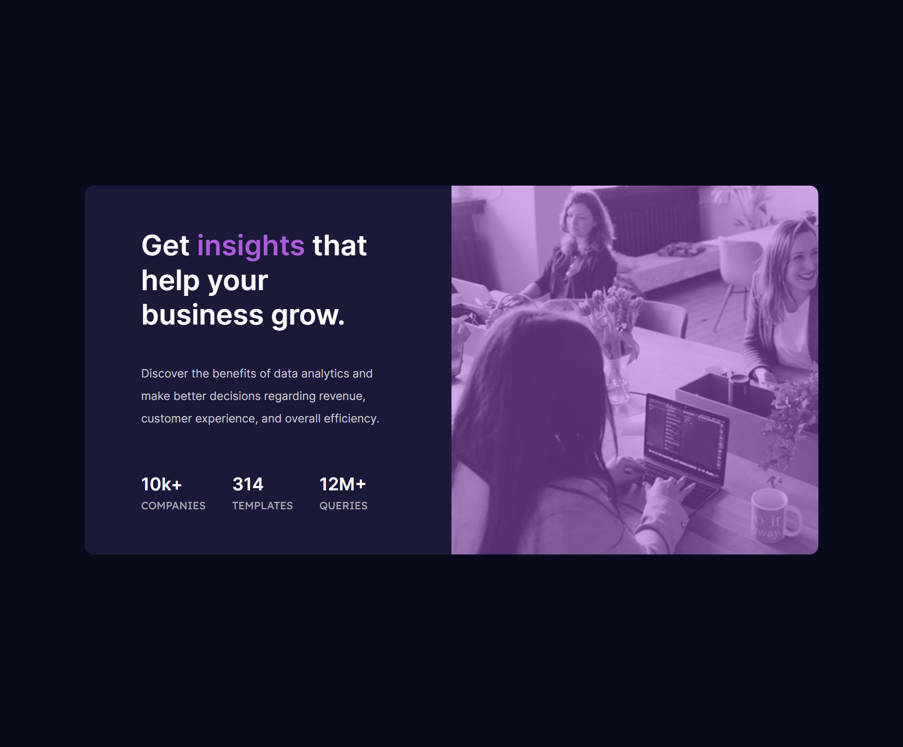

# Frontend Mentor - Stats preview card component solution

This is a solution to the [Stats preview card component challenge on Frontend Mentor](https://www.frontendmentor.io/challenges/stats-preview-card-component-8JqbgoU62). Frontend Mentor challenges help you improve your coding skills by building realistic projects. 

## Table of contents

- [Overview](#overview)
  - [The challenge](#the-challenge)
  - [Screenshot](#screenshot)
  - [Links](#links)
- [My process](#my-process)
  - [Built with](#built-with)
  - [What I learned](#what-i-learned)
  - [Continued development](#continued-development)
  - [Useful resources](#useful-resources)
- [Author](#author)

## Overview

### The challenge

Users should be able to:

- View the optimal layout depending on their device's screen size

### Screenshot

### Links

- Solution URL: [https://github.com/wildangunawan/FM-Challenges/stats_preview_card](https://github.com/wildangunawan/FM-Challenges/stats_preview_card)
- Live Site URL: [https://wildangunawan.github.io/FM-Challenges/stats_preview_card/dist/](https://wildangunawan.github.io/FM-Challenges/stats_preview_card/dist/)

## My process

### Built with

- Semantic HTML5 markup
- Flexbox
- CSS Grid
- Mobile-first workflow

### What I learned

I hate frontend development so much. I just cannot design thing well to see in web, so I gave up few years ago. This month (when I write this), I get a big responsibility to create a new system that have both frontend and backend, from scratch, and it should be unique. ARGH.

OK, enough talking. What I learned so much here is flexbox and grid. It's so awesome and way easier for us to make skeleton of a design. When I first start get my hand at the project, I created the skeleton first. No custom style whatsoever. Make div that will be used, add border to make it easier to be differentiated, then setup the grid layout.

When layout is done, I start adding color and image first. Image is one of the biggest thing that make my CSS journey hard. It doesn't scale well, or it just doesn't work at all. WTF. So after image is done, I can continue to the text without needing to think about the image 😊.

### Continued development

I wanted to learn Tailwind CSS to build my own website that is unique. Therefore, I'll take this mini project as one of my starting point to Tailwind CSS.

Also, I'm eager to learn how to correctly adjust font size in big screen. Currently the text is way too small in 4K screen. Looking for clamp() but I don't think it will be OK. Looking forward to hear input from frontend expert 😁.

### Useful resources

- [Kevin Powell's Youtube Channel](https://www.youtube.com/user/KepowOb) - He is a CSS master, if not king. I learned grid and flexbox so well from his video. Highly recommended! 👍
- [Traversy Media](https://www.youtube.com/user/TechGuyWeb) - This channel also helped me to learn CSS grid and flexbox. He explains the concept very clear.
- [GRID by Malven Co.](https://grid.malven.co/) - I don't know where I found this web, but since day one I found it, I just can't not visit it when I'm doing layout.

## Author

- Website - [Wildan Gunawan](https://wildan.web.id)
- Frontend Mentor - [@wildangunawan](https://www.frontendmentor.io/profile/wildangunawan)
